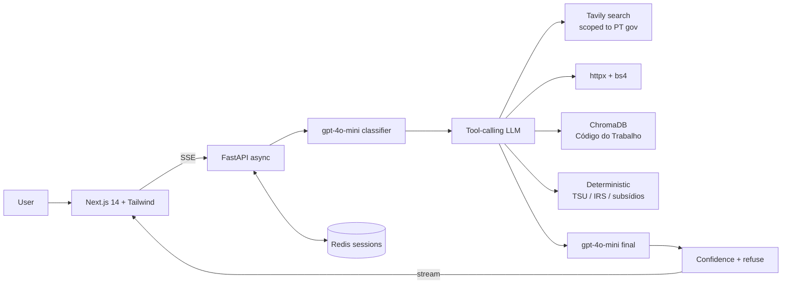

# HomoDeus · Portuguese Labor Law Q&A Agent

Production-grade conversational agent for Portuguese labor law and payroll.
Hybrid retrieval (vector index + live web), deterministic salary calculators,
tool-calling architecture, real-time SSE streaming, and a rigorous LLM-as-judge
evaluation harness with measurable v1→v2 improvements.

> Built for the **HomoDeus AI Engineer Challenge 2026**.

---

## Demonstração

- **Chat em tempo real** com streaming de tokens, inspector de tool calls e citações vivas.
- **Recusa graciosa** quando a confiança cai abaixo do limiar.
- **Dashboard de avaliação** v1 vs v2 com correctness, citation quality, refusal accuracy e latência.



---

## Quickstart (5 minutos)

### Pré-requisitos
- Python 3.11+
- Node.js 20+
- (opcional) Docker + Docker Compose
- API keys (ambas têm **plano gratuito** que cobre este case):
  - **Groq** — [console.groq.com](https://console.groq.com) · sem cartão de crédito · default do projeto
  - **Tavily** — [tavily.com](https://tavily.com) · 1.000 pesquisas/mês grátis
  - *(opcional)* **OpenAI** — só se preferires `gpt-4o-mini` em vez de Llama no Groq

> Embeddings rodam **localmente** por defeito (ONNX MiniLM via ChromaDB) — não precisas de chave OpenAI para indexar o Código do Trabalho.

### Opção A — Docker Compose (recomendado)

```bash
cp .env.example .env
# editar .env e preencher GROQ_API_KEY e TAVILY_API_KEY

docker compose up --build
```

Acessa a:
- Frontend: http://localhost:3000
- Backend: http://localhost:8000/health
- Docs API: http://localhost:8000/docs

### Opção B — Dev local

**Backend:**
```bash
cd backend
python -m venv .venv
# Windows: .venv\Scripts\activate
# Unix:    source .venv/bin/activate
pip install -r requirements.txt
cp ../.env.example ../.env  # editar com as chaves
python -m app.retrieval.indexer        # indexa o Código do Trabalho (1ª vez, ~30 s)
uvicorn app.main:app --reload --port 8000
```

**Frontend:**
```bash
cd frontend
npm install --legacy-peer-deps
npm run dev
# http://localhost:3000
```

---

## Variáveis de ambiente

| Variável | Default | Descrição |
|---|---|---|
| `LLM_PROVIDER` | `groq` | `groq` (free, recomendado) ou `openai`. |
| `GROQ_API_KEY` | — | Obrigatória se `LLM_PROVIDER=groq`. Free tier em [console.groq.com](https://console.groq.com). |
| `GROQ_MODEL` | `llama-3.3-70b-versatile` | LLM principal (suporta tool calling). |
| `GROQ_JUDGE_MODEL` | `llama-3.3-70b-versatile` | LLM-as-judge. |
| `OPENAI_API_KEY` | — | Só se `LLM_PROVIDER=openai` ou `EMBEDDINGS_PROVIDER=openai`. |
| `OPENAI_MODEL` | `gpt-4o-mini` | LLM principal (alternativa premium). |
| `OPENAI_JUDGE_MODEL` | `gpt-4o` | LLM-as-judge premium. |
| `EMBEDDINGS_PROVIDER` | `local` | `local` (ONNX MiniLM, sem chave) ou `openai`. |
| `TAVILY_API_KEY` | — | Pesquisa web filtrada pelas fontes oficiais PT. Free tier em [tavily.com](https://tavily.com). |
| `REDIS_URL` | `redis://localhost:6379` | Estado de conversação (fallback in-memory). |
| `AGENT_VERSION` | `v2` | `v1` (baseline) ou `v2` (full). |
| `CONFIDENCE_THRESHOLD` | `0.55` | Abaixo disto → recusa graciosa. |
| `CHROMA_PERSIST_DIR` | `./data/chroma` | Storage local do ChromaDB. |
| `CORS_ORIGINS` | `http://localhost:3000` | Origens permitidas (csv). |
| `NEXT_PUBLIC_API_URL` | `http://localhost:8000` | URL do backend para o frontend. |

### Trocar para OpenAI (opcional)

```bash
# no .env:
LLM_PROVIDER=openai
OPENAI_API_KEY=sk-...
EMBEDDINGS_PROVIDER=openai   # opcional, ligeiramente melhor que MiniLM local
```

---

## Componentes

### 1. Camada de retrieval — [`backend/app/agent/tools/`](backend/app/agent/tools/)

| Tool | Para quê |
|---|---|
| [`search_web`](backend/app/agent/tools/web_search.py) | Tavily, scoped a `portal.act.gov.pt`, `info.portaldasfinancas.gov.pt`, `diariodarepublica.pt`, `cite.gov.pt`, `seg-social.pt`. |
| [`fetch_url`](backend/app/agent/tools/doc_fetcher.py) | httpx + BeautifulSoup, com whitelist rígida de domínios oficiais. |
| [`search_labor_code`](backend/app/agent/tools/labor_index.py) | Pesquisa semântica sobre o Código do Trabalho, indexado por **artigo**. |
| [`calculate`](backend/app/agent/tools/calculator.py) | TSU, IRS 2025, subsídio de férias e Natal — Python puro, fonte citada. |

### 2. Agente conversacional — [`backend/app/agent/graph.py`](backend/app/agent/graph.py)

Pipeline `classify → plan → tools → generate → confidence → refuse?`. Streaming SSE em [`backend/app/api/routes/chat.py`](backend/app/api/routes/chat.py).

### 3. Suite de avaliação — [`backend/app/evaluation/`](backend/app/evaluation/)

15 casos anotados em [`test_cases.py`](backend/app/evaluation/test_cases.py). Métricas e juiz LLM:

```bash
cd backend
python -m app.evaluation.harness --version both --concurrency 4
```

Resultados em `backend/evaluation_results/{v1,v2}_results.json` e `v1_vs_v2.json`. Frontend `/eval` mostra a comparação.

---

## Endpoints

| Método | Rota | O quê |
|---|---|---|
| POST | `/chat` | Pergunta + resposta JSON (não-stream). |
| GET | `/chat/stream?message=...&conversation_id=...&agent_version=v2` | SSE com phases, tool calls, sources, tokens, confidence. |
| GET | `/chat/conversations/{id}` | Histórico de uma conversa. |
| GET | `/eval/cases` | Casos de teste anotados. |
| POST | `/eval/run` `{agent_version, concurrency}` | Corre o harness async. |
| GET | `/eval/results?version=v2` | Resultados persistidos. |
| GET | `/health` | Healthcheck. |

---

## Escalabilidade

- API stateless · sessão em Redis (TTL 2 h).
- Async total: FastAPI + httpx pool (200 conn) + Tavily async + asyncio.gather paralelo.
- 4 uvicorn workers no Dockerfile · pronto para HPA atrás de LB.
- SSE com `X-Accel-Buffering: no` para reverse proxies (nginx).
- Rate limit por IP (`slowapi`, 120 rpm default).
- Para 1000 utilizadores simultâneos: 4-8 réplicas do backend + Redis cluster + Pinecone/Qdrant gerido (ver [`docs/report.md`](docs/report.md) §5).

---

## Tecnologias

**Backend:** Python 3.11, FastAPI, OpenAI tool calling, ChromaDB, Tavily, httpx, BeautifulSoup, Redis, Loguru, Slowapi.
**Frontend:** Next.js 14 (App Router), TypeScript, Tailwind, Radix Primitives, Framer Motion, Recharts, react-markdown.
**Infra:** Docker Compose · `.env`-driven config · 4-worker uvicorn.

---

## Licença & contacto

Submetido como prova técnica para HomoDeus. Decisões e trade-offs detalhados em [`docs/report.md`](docs/report.md).
