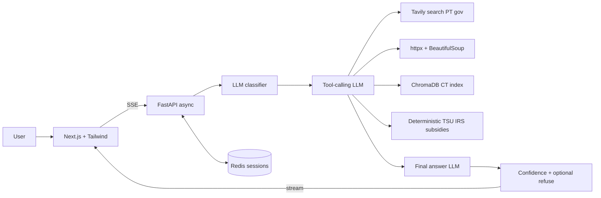

# HomoDeus · Portuguese Labor Law Q&A Agent

Production-grade conversational agent for Portuguese labor law and payroll.
Hybrid retrieval (vector index + live web), deterministic salary calculators,
tool-calling architecture, real-time SSE streaming, and an evaluation harness
with measurable v1→v2 comparison.

> Built for the **HomoDeus AI Engineer Challenge** (brief: *homodeus-challenge-9.pdf*).

---

## O que pede o desafio (PDF, página 8 — Submissão)

| Item | Requisito |
|------|-----------|
| **Repositório** | GitHub público com **README** que explique **como correr o agente localmente em menos de 5 minutos**. |
| **Relatório** | Documento conciso (PDF ou Markdown, **máx. 2 páginas**): decisões de arquitetura, resultados de avaliação, próximos passos com mais uma semana. → [`docs/report.md`](docs/report.md) |
| **Prazo / envio** | Conforme o briefing oficial (email indicado no PDF). |

O passo a passo abaixo começa no **clone** e cobre **Docker** e **máquina local** até ter chat, API e (opcional) avaliação a funcionar.

---

## Passo a passo completo — da clonagem ao agente a correr

### 0. Pré-requisitos

| Ferramenta | Versão mínima | Notas |
|------------|---------------|--------|
| **Git** | qualquer | Para clonar o repositório. |
| **Python** | 3.11+ | Backend FastAPI. |
| **Node.js** | 20+ | Frontend Next.js. |
| **Docker + Docker Compose** | opcional | Recomendado para subir tudo de uma vez (backend + Redis + frontend). |
| **Chaves API** | Groq + Tavily | Plano gratuito suficiente para o case ([Groq](https://console.groq.com), [Tavily](https://tavily.com)). OpenAI é **opcional** (`LLM_PROVIDER=openai`). |

Embeddings do Código do Trabalho: por defeito **locais** (ONNX MiniLM via ChromaDB, ~80 MB na primeira utilização) — **não** precisas de chave OpenAI só para indexar.

---

### 1. Clonar o repositório

```bash
git https://github.com/solerpedroo/case_homodeus
cd case_homodeus
```

---

### 2. Configurar o ambiente (`.env` na raiz do projeto)

```bash
cp .env.example .env
```

Edita `.env` e **preenche no mínimo**:

- `GROQ_API_KEY` — obrigatório se usares `LLM_PROVIDER=groq` (default).
- `TAVILY_API_KEY` — obrigatório para pesquisa web em fontes oficiais PT.

Opcional: `OPENAI_API_KEY` e `LLM_PROVIDER=openai` se quiseres usar OpenAI em vez de Groq.

Lista completa de variáveis: secção **Variáveis de ambiente** mais abaixo.

---

### 3. Opção A — Docker Compose (recomendado para “menos de 5 minutos”)

Na **raiz** do repositório (onde está `docker-compose.yml`):

```bash
docker compose up --build
```

Isto sobe:

- **Redis** (sessões / histórico de conversa),
- **Backend** FastAPI em `http://localhost:8000`,
- **Frontend** Next.js em `http://localhost:3000`.

**Primeira vez — indexar o Código do Trabalho (obrigatório para `search_labor_code`):**  
O contentor não corre o indexer automaticamente. Após os serviços estarem de pé, num **segundo terminal** na raiz do repo:

```bash
docker compose exec backend python -m app.retrieval.indexer
```

(~30–60 s: descarrega o PDF da ACT, faz chunking por artigo, grava embeddings no volume `chroma-data`.)

**Verificar:**

- Frontend: [http://localhost:3000](http://localhost:3000) (redireciona para `/chat`)
- API health: [http://localhost:8000/health](http://localhost:8000/health)
- Swagger: [http://localhost:8000/docs](http://localhost:8000/docs)

---

### 4. Opção B — Desenvolvimento local (sem Docker)

#### 4.1 Backend

```bash
cd backend
python -m venv .venv
```

Ativar o venv:

- **Windows (PowerShell):** `.\.venv\Scripts\Activate.ps1`
- **macOS / Linux:** `source .venv/bin/activate`

```bash
pip install -r requirements.txt
```

Garante que o `.env` na **raiz** do repositório (pasta pai) está preenchido — o backend lê `backend/.env` ou variáveis exportadas; o mais simples é manter `.env` na raiz e, se necessário, copiar ou apontar para a mesma configuração que o `docker-compose` usa (ver `.env.example`).

**Indexação (primeira vez, na pasta `backend` com venv ativo):**

```bash
python -m app.retrieval.indexer
```

**Arrancar o servidor:**

```bash
uvicorn app.main:app --reload --host 0.0.0.0 --port 8000
```

**Redis (opcional):** se tiveres Redis em `redis://localhost:6379`, as conversas persistem entre reinícios; se não, o código usa **fallback em memória** (suficiente para desenvolvimento).

#### 4.2 Frontend

Num **outro terminal**:

```bash
cd frontend
npm install
npm run dev
```

Abre [http://localhost:3000](http://localhost:3000).

> **Windows:** corre `npm install` e `npm run dev` **dentro de `frontend/`**, não na raiz do monorepo.

Garante que `NEXT_PUBLIC_API_URL` no `.env` da raiz aponta para o backend (default `http://localhost:8000`).

---

### 5. Utilizar a aplicação (após os passos acima)

1. **Chat** — `/chat`: faz perguntas sobre direito laboral e salários em PT; o backend faz streaming (SSE) com fases, tool calls e fontes.
2. **Idioma** — switcher **PT / EN** no header: em EN, as explicações vêm em inglês e **citações legais mantêm-se em português** (ex.: `Art. 238.º CT`, `Lei 110/2009`).
3. **Avaliação** — `/eval`: dashboard v1 vs v2 (métricas persistidas em `backend/evaluation_results/` quando corres o harness).
4. **Versão do agente** — no header podes alternar **v1** (baseline, só web) e **v2** (pipeline completo).

---

### 6. (Opcional) Correr a suite de avaliação no terminal

Com o backend configurado e o `.env` válido, na pasta `backend` com venv ativo:

```bash
python -m app.evaluation.harness --version both --concurrency 4
```

Gera/atualiza `backend/evaluation_results/v1_results.json`, `v2_results.json` e `v1_vs_v2.json`. A página `/eval` lê estes ficheiros.

Também podes disparar avaliação via API: `POST /eval/run` (ver tabela abaixo em **Endpoints**).

---

### 7. Resolução de problemas rápida

| Sintoma | O que fazer |
|---------|-------------|
| `LLM provider ... is not configured` | Define `GROQ_API_KEY` (ou `OPENAI_API_KEY` com `LLM_PROVIDER=openai`). |
| `TAVILY_API_KEY is not configured` | Preenche `TAVILY_API_KEY` no `.env`; sem isso a pesquisa web falha (ferramenta `search_web`). |
| Respostas sem artigos do CT / índice vazio | Corre `python -m app.retrieval.indexer` (local) ou `docker compose exec backend python -m app.retrieval.indexer` (Docker). |
| Frontend não fala com o API | Confirma `NEXT_PUBLIC_API_URL=http://localhost:8000` e que o backend está na porta 8000. |
| Erro ao instalar pacotes Node | Executa `npm install` dentro de **`frontend/`**. |

---

## Arquitetura (resumo)



---

## Variáveis de ambiente

| Variável | Default | Descrição |
|----------|---------|-----------|
| `LLM_PROVIDER` | `groq` | `groq` ou `openai`. |
| `GROQ_API_KEY` | — | Obrigatória com Groq. |
| `GROQ_MODEL` | `llama-3.3-70b-versatile` | Modelo principal. |
| `GROQ_JUDGE_MODEL` | `llama-3.3-70b-versatile` | LLM-as-judge no eval. |
| `OPENAI_API_KEY` | — | Se `LLM_PROVIDER=openai` ou embeddings OpenAI. |
| `OPENAI_MODEL` | `gpt-4o-mini` | Alternativa OpenAI. |
| `OPENAI_JUDGE_MODEL` | `gpt-4o` | Juiz OpenAI. |
| `EMBEDDINGS_PROVIDER` | `local` | `local` (MiniLM, sem chave) ou `openai`. |
| `TAVILY_API_KEY` | — | Pesquisa web em domínios oficiais. |
| `REDIS_URL` | `redis://localhost:6379` | Em Docker Compose o serviço define `redis://redis:6379`. |
| `AGENT_VERSION` | `v2` | Default do contentor; o UI pode forçar v1/v2 por pedido. |
| `CONFIDENCE_THRESHOLD` | `0.55` | Abaixo: possível recusa na v2. |
| `CHROMA_PERSIST_DIR` | `./data/chroma` | Persistência do índice. |
| `CORS_ORIGINS` | `http://localhost:3000` | Origens CORS (CSV). |
| `NEXT_PUBLIC_API_URL` | `http://localhost:8000` | URL do API no browser. |

### Trocar para OpenAI (opcional)

```bash
# .env
LLM_PROVIDER=openai
OPENAI_API_KEY=sk-...
# opcional:
EMBEDDINGS_PROVIDER=openai
```

---

## Componentes principais (mapa do código)

### 1. Retrieval — [`backend/app/agent/tools/`](backend/app/agent/tools/)

| Tool | Função |
|------|--------|
| [`web_search.py`](backend/app/agent/tools/web_search.py) | Tavily com domínios oficiais PT. |
| [`doc_fetcher.py`](backend/app/agent/tools/doc_fetcher.py) | Fetch + parse HTML (whitelist de hosts). |
| [`labor_index.py`](backend/app/agent/tools/labor_index.py) | Pesquisa semântica sobre o CT indexado. |
| [`calculator.py`](backend/app/agent/tools/calculator.py) | TSU, IRS (tabela codificada), subsídios — determinístico. |

### 2. Agente — [`backend/app/agent/graph.py`](backend/app/agent/graph.py)

Pipeline v2: `classify → plan → tools → … → generate → confidence → refuse?`.  
Streaming: [`backend/app/api/routes/chat.py`](backend/app/api/routes/chat.py).

### 3. Avaliação — [`backend/app/evaluation/`](backend/app/evaluation/)

Casos em [`test_cases.py`](backend/app/evaluation/test_cases.py) (inclui as perguntas de exemplo do briefing + extras).

---

## Endpoints úteis

| Método | Rota | Descrição |
|--------|------|-----------|
| POST | `/chat` | Pergunta/resposta JSON (sem stream). |
| GET | `/chat/stream?message=...&conversation_id=...&agent_version=v2&locale=pt` | SSE (tokens, fases, tools, fontes). |
| GET | `/chat/conversations`, `/chat/conversations/{id}` | Lista / histórico. |
| DELETE | `/chat/conversations/{id}` | Apagar conversa. |
| GET | `/eval/cases` | Casos de teste. |
| POST | `/eval/run` | Correr harness (`agent_version`, `concurrency`). |
| GET | `/eval/results` | JSON de resultados persistidos. |
| GET | `/health` | Healthcheck. |

---

## Escalabilidade (nota breve)

API stateless; sessões em Redis (TTL 2 h). Pool HTTP assíncrono, rate limit por IP (`slowapi`). Detalhes e próximos passos em [`docs/report.md`](docs/report.md).

---

## Tecnologias

**Backend:** Python 3.11, FastAPI, OpenAI-compatible SDK (Groq/OpenAI), ChromaDB, Tavily, httpx, BeautifulSoup, Redis, Loguru, Slowapi.  
**Frontend:** Next.js (App Router), TypeScript, Tailwind, Radix, Framer Motion, Recharts, react-markdown.  
**Infra:** Docker Compose, uvicorn multi-worker no Dockerfile do backend.

---

## Licença e relatório

Submissão técnica HomoDeus. Decisões, métricas v1→v2 e roadmap de uma semana: **[`docs/report.md`](docs/report.md)** (≤ 2 páginas, Markdown).
